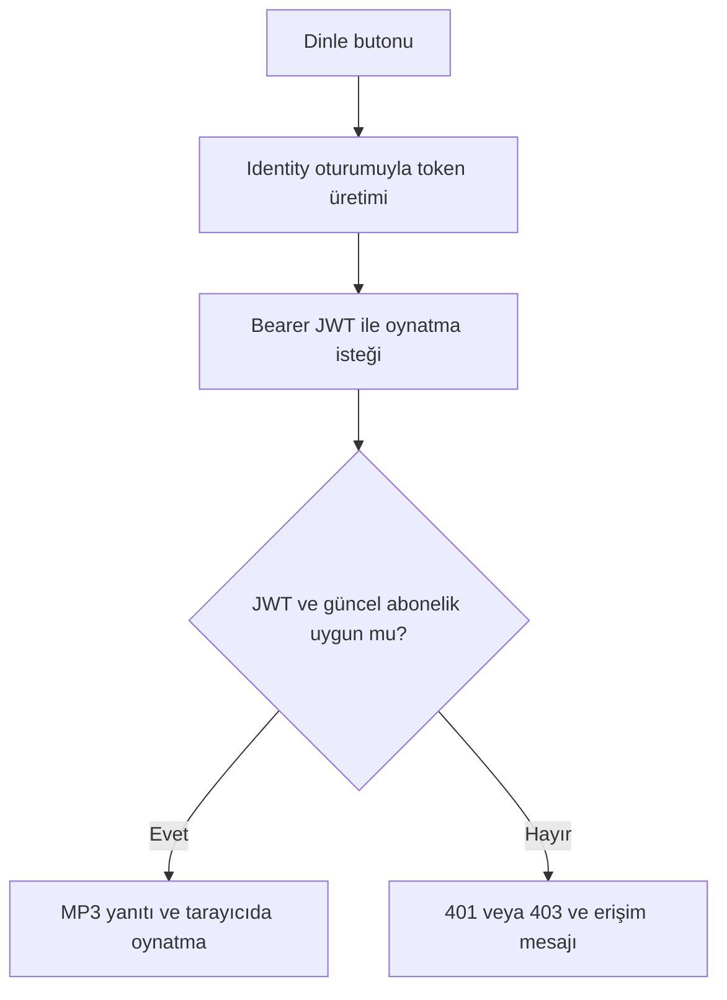

# 🎧 Soundora

### Müzik ve podcast keşfi • JWT ile paket kontrollü oynatma • Identity ile rol yönetimi


**Soundora**, kullanıcıların müzik ve podcast keşfedebildiği, abonelik seviyelerine göre içerik dinleyebildiği bir **ASP.NET Core MVC** uygulamasıdır. Yönetim tarafında içerikler, kategoriler, sanatçılar, paketler ve kullanıcı abonelikleri yönetilir.

Proje, **M&Y Yazılım Eğitim Akademi Danışmanlık** bünyesinde **Murat Yücedağ** mentörlüğündeki JWT–Identity case çalışması kapsamında geliştirilmiştir.

Temel amaç; kullanıcı oturumunu, yönetim yetkilerini ve içerik erişim haklarını birlikte ele alan bir uygulama geliştirmektir. **Identity** kayıt, giriş ve rol kontrolünü; **JWT** ise oynatma isteklerinin doğrulanmasını sağlar. Basic/Gold erişimi, token içindeki paket bilgileri ile veritabanındaki güncel abonelik karşılaştırılarak değerlendirilir.

> Soundora bir .NET 8 MVC uygulamasıdır. Kullanıcı arayüzü Razor görünümlerinden oluşur. Token ve oynatma endpoint’leri aynı Presentation projesinde yer alır; ayrı bir Web API projesi bulunmaz.

---

## İçindekiler

- [Öne çıkan özellikler](#öne-çıkan-özellikler)
- [Teknolojiler](#teknolojiler)
- [Mimari ve proje yapısı](#mimari-ve-proje-yapısı)
- [Roller ve yönetim yetkileri](#roller-ve-yönetim-yetkileri)
- [Paketler ve abonelikler](#paketler-ve-abonelikler)
- [JWT ile oynatma akışı](#jwt-ile-oynatma-akışı)
- [Dosya yükleme ve kapak yönetimi](#dosya-yükleme-ve-kapak-yönetimi)
- [Veri modeli](#veri-modeli)
- [Kurulum](#kurulum)
- [Uygulama rotaları](#uygulama-rotaları)
- [Doğrulanan senaryolar](#doğrulanan-senaryolar)
- [Mevcut kapsam ve geliştirme notları](#mevcut-kapsam-ve-geliştirme-notları)
- [Geliştirici ve teşekkür](#geliştirici-ve-teşekkür)

## Öne çıkan özellikler

### Dinleyici deneyimi

- Kullanıcı adı ve şifreyle kayıt/giriş, güvenli çıkış işlemi.
- Ana sayfada müzik ve podcast katalogları.
- Müzik veya sanatçı adına göre arama.
- Podcast veya sunucu adına göre arama.
- İki katalog için bağımsız filtreler ve altışar kayıtla sayfalama.
- İçeriğe özel kapak, sanatçı/sunucu ve paket bilgilerinin gösterimi.
- Müzik ve podcast için ortak ses oynatıcı; yeni içerik seçildiğinde önceki sesin durdurulması.
- Paket yetersizliğinde veya abonelik yokluğunda açıklayıcı erişim mesajları.
- **Aboneliğim** ekranından son atanan paket, başlangıç/bitiş tarihi ve durum görüntüleme.
- Masaüstü ve mobil kullanım için Bootstrap tabanlı arayüz.

### Yönetim deneyimi

- **Kategori:** listeleme, oluşturma, güncelleme, aktif/pasif durumu ve silme.
- **Sanatçı:** listeleme, oluşturma, güncelleme, aktif/pasif durumu ve silme.
- **Müzik:** MP3 yükleme, listeleme, bilgi/kapak güncelleme, aktif/pasif durumu ve silme.
- **Podcast:** MP3 yükleme, sunucu seçimi, listeleme, bilgi/kapak güncelleme ve silme.
- **Paket:** fiyat, süre, erişim seviyesi ve aktiflik yönetimi.
- **Abonelik:** kullanıcıya paket atama, geçmiş kayıtlar ve güncel durum listeleme.
- Bağlı içeriği bulunan kategori/sanatçının ve abonelik geçmişi bulunan paketin silinmesini engelleme.
- Silinen içeriklerin MP3 ve yüklenen kapak dosyalarını temizleme.

## Teknolojiler

| Teknoloji / araç | Projedeki kullanım |
|---|---|
| **C# / .NET 8** | Uygulama ve iş kuralları |
| **ASP.NET Core MVC** | Controller, Razor View, routing ve HTTP yanıtları |
| **ASP.NET Core Identity** | Kullanıcılar, roller, parola yönetimi ve cookie oturumu |
| **JWT Bearer Authentication** | Oynatma isteklerinde imzalı token doğrulama |
| **System.IdentityModel.Tokens.Jwt** | JWT üretimi, claim’ler ve token serileştirme |
| **Microsoft.IdentityModel.Tokens** | İmzalama anahtarı ve doğrulama parametreleri |
| **Entity Framework Core 8** | LINQ sorguları, ilişkiler, Code First ve migration’lar |
| **SQL Server** | Kullanıcı, içerik, paket ve abonelik verileri |
| **Dependency Injection** | Servis arayüzlerinin uygulamalarına bağlanması |
| **Data Annotations** | Form ve servis girişlerinin doğrulanması |
| **Razor ViewComponent** | Layout ve katalog bölümlerinin bileşenlere ayrılması |
| **Areas** | Admin controller ve view’larının düzenlenmesi |
| **Bootstrap 4 / One Music** | Responsive görünüm ve tema |
| **JavaScript Fetch API** | Token üretme ve Bearer başlıklı oynatma isteği |
| **jQuery / jQuery Validation** | Tema etkileşimleri ve uygun formlarda istemci doğrulaması |
| **Owl Carousel / ClassyNav / Font Awesome** | Slider, mobil menü ve ikonlar |
| **TagLibSharp** | Yüklenen MP3 dosyalarının ses bilgileri ve süresinin okunması |
| **SixLabors.ImageSharp** | Kapak formatı doğrulama, boyutlandırma ve PNG çıktısı |
| **User Secrets** | Geliştirme ortamında JWT imzalama anahtarı |
| **ILogger** | İşlem ve dosya temizleme hatalarının kaydı |
| **Git / GitHub** | Sürüm kontrolü ve özellik bazlı commit’ler |

Kesin NuGet sürümleri ilgili `.csproj` dosyalarındadır. Proje doğrudan EF Core ve uygulama servisleri kullanır; CQRS, MediatR, Dapper veya ayrı bir frontend SPA bu uygulamanın mevcut teknoloji setine dahil değildir.

## Mimari ve proje yapısı

Soundora, sorumlulukları beş projeye ayıran **Clean Architecture yaklaşımından yararlanan katmanlı bir mimari** kullanır.

| Konum | Sorumluluk |
|---|---|
| `Core/Soundora.Domain` | Entity’ler, ortak entity davranışları ve enum’lar |
| `Core/Soundora.Application` | Servis sözleşmeleri, DTO’lar, istek/sonuç modelleri ve doğrulamalar |
| `Infrastructure/Soundora.Persistence` | EF Core, SQL Server, Identity sınıfları, konfigürasyonlar, migration’lar, seed ve veri erişen servisler |
| `Infrastructure/Soundora.Infrastructure` | JWT üretimi, MP3 ve kapak dosyası saklama |
| `Presentation/Soundora.Presentation` | MVC controller’ları, Admin Area, ViewModel’ler, Razor görünümleri, ViewComponent’ler ve statik kaynaklar |

Normal bir işlemde controller isteği alır, Application arayüzü üzerinden ilgili servisi çağırır ve sonucu view’a taşır. Persistence veritabanı işlemlerini, Infrastructure dosya ve token işlemlerini yürütür. Presentation, DI kayıtlarının bir araya getirildiği uygulama başlangıç noktasıdır.

### ViewComponent düzeni

Ortak görünümler `Views/Shared/Components` altında, her bileşenin kendi klasöründeki `Default.cshtml` dosyasında bulunur. C# tarafları `ViewComponents` klasöründedir.

| Bileşen | Görev |
|---|---|
| `_LayoutHeadComponentPartial` | Meta ve stil bağlantıları |
| `_LayoutHeaderComponentPartial` | Navigasyon ve oturuma/role göre menü |
| `_LayoutFooterComponentPartial` | Footer |
| `_LayoutScriptComponentPartial` | Tema script’leri |
| `_HomeSliderComponentPartial` | Ana sayfa slider’ı |
| `_HomeLatestMusicComponentPartial` | Arama ve sayfalama destekli müzik kataloğu |
| `_HomeLatestPodcastComponentPartial` | Arama ve sayfalama destekli podcast kataloğu |

Ana kullanıcı layout’u `Views/Shared/_UI_Layout.cshtml` dosyasıdır. Component adlarındaki “Latest” ifadesi korunmakla birlikte kataloglar artık sayfalama üzerinden önceki içeriklere de erişim sağlar.

## Roller ve yönetim yetkileri

| İşlem | Member | Manager | Admin |
|---|:---:|:---:|:---:|
| Katalogları görüntüleme | ✓ | ✓ | ✓ |
| Kendi aboneliğini görüntüleme | ✓ | ✓ | ✓ |
| Paketine uygun içerik dinleme | ✓ | ✓ | ✓ |
| Yönetim müzik listesini görüntüleme | — | ✓ | ✓ |
| Müzik ekleme/güncelleme/silme | — | — | ✓ |
| Podcast yönetimi | — | — | ✓ |
| Kategori ve sanatçı yönetimi | — | — | ✓ |
| Paket yönetimi ve kullanıcıya paket atama | — | — | ✓ |
| Abonelik geçmişini görüntüleme | — | — | ✓ |

Ziyaretçiler katalogları inceleyebilir; dinlemek için giriş yapmaları gerekir. **Admin rolü, dinleme için paket kontrolünü atlamaz.** Yönetim yetkisi ile abonelik erişimi ayrı değerlendirilir.

Yetkilendirme yalnızca butonların gizlenmesine dayanmaz. Controller/action düzeyindeki `[Authorize]` kuralları doğrudan istekleri de korur. Veri değiştiren form action’larında POST ve antiforgery doğrulaması kullanılır.

## Paketler ve abonelikler

| Kullanıcı durumu | Basic müzik | Gold müzik | Podcast |
|---|:---:|:---:|:---:|
| Aktif abonelik yok | — | — | — |
| Süresi dolmuş abonelik | — | — | — |
| Aktif Basic | ✓ | — | — |
| Aktif Gold | ✓ | ✓ | ✓ |

Paket adı ile erişim seviyesi ayrı alanlardır. Örneğin **Gold Yıllık**, 365 gün süreli ve Gold erişim seviyeli bir paket olarak tanımlanabilir. Podcast’ler sunucu tarafında Gold seviyesinde oluşturulur.

### Paket atama davranışı

1. Admin kullanıcıyı ve aktif paketi seçer.
2. Kullanıcının önceki aktif abonelikleri pasif yapılır.
3. Yeni abonelik atama anında başlar.
4. Bitiş tarihi paketin gün cinsinden süresinden hesaplanır.
5. İşlemler veritabanı transaction’ı içinde kaydedilir.

Önceki aboneliğin kalan süresi yeni pakete aktarılmaz. Eski kayıtlar geçmiş olarak tutulur. Tarihler UTC olarak saklanır; ilgili ekranlarda UTC+3 ile gösterilir.

**Paket güncellemenin etkisi:** Süre değişikliği yeni atamalarda kullanılır; mevcut aboneliklerin bitiş tarihi değişmez. Paket seviyesi veya aktifliği değişirse mevcut aboneliklerin erişimi de etkilenir. Herhangi bir abonelik kaydının bağlı olduğu paket silinemez.

## JWT ile oynatma akışı



### Oturum ve token ayrımı

- **Identity cookie:** Kayıt sonrası giriş, çıkış ve yönetim ekranları.
- **JWT:** `PlaybackJwt` politikasıyla korunan oynatma endpoint’i.
- **Veritabanı kontrolü:** Kullanıcı, içerik, aktif kategori, güncel abonelik ve paket yeterliliği.

Dinle butonu önce antiforgery korumalı token üretim action’ını çağırır. Kullanıcı ve abonelik bilgileri sunucuda okunur; istemciden gelen paket iddiasına güvenilmez. Token sonraki istekte `Authorization: Bearer ...` başlığına eklenir.

### JWT içeriği

| Claim | Anlam |
|---|---|
| `sub` | Kullanıcı kimliği |
| `unique_name` | Kullanıcı adı |
| `email` | E-posta |
| `role` | Kullanıcının rolleri |
| `jti` | Token kimliği |
| `iat` | Üretilme zamanı |
| `subscription_id` | Abonelik atama kaydı |
| `package_id` | Paket tanımı |
| `package_level` | 0: aktif paket yok, 1: Basic, 2: Gold |
| `package_expires_at` | Abonelik bitişi, Unix saniyesi |

Aktif paketi olmayan kullanıcıda paket seviyesi `0` olur; diğer abonelik claim’leri oluşturulmaz. Token HS256 ile imzalanır. Issuer, audience, imza, algoritma ve geçerlilik süresi doğrulanır. Varsayılan token süresi 15 dakika, saat toleransı 30 saniyedir.

Token’daki abonelik kimliği, paket kimliği, seviye ve bitiş zamanı güncel kayıtla karşılaştırılır. Paket değiştiğinde eski token reddedilir. Kullanıcı tekrar Dinle’ye bastığında yeni token üretilir. Token süresi ile abonelik bitişi birbirinden bağımsız olarak kontrol edilir.

### Yanıtlar ve oynatma biçimi

- **401:** Eksik/geçersiz/süresi dolmuş JWT veya güncelliğini yitirmiş paket claim’leri.
- **403:** Aktif abonelik bulunmaması ya da paket seviyesinin yetersizliği.
- **404:** İçeriğin oynatmaya açık olmaması veya dosyanın bulunamaması.

JavaScript, başarılı ses yanıtını `Blob` olarak alıp geçici bir object URL üzerinden HTML audio öğesine bağlar. JWT URL’ye veya `localStorage` içine yazılmaz. Yeni içerik seçildiğinde önceki oynatma durdurulur ve eski object URL temizlenir.

**Mevcut oynatma, MP3 indirildikten sonra başlar.** Sunucu range isteğini desteklese de bu frontend akışı dosyanın tamamını alır; HLS/DASH veya kesintisiz adaptif streaming kullanılmaz. Paket değişikliği yeni istekleri etkiler; tarayıcıya daha önce indirilmiş ses geri alınmaz.

## Dosya yükleme ve kapak yönetimi

### MP3

- Dosya başına **20 MB** sınırı.
- Uzantı, boş dosya ve okunan ses özelliklerinin kontrolü.
- TagLibSharp ile süre, bitrate ve örnekleme hızı kontrolü.
- Sunucuda üretilen rastgele dosya adları.
- Presentation projesinde `App_Data/Audio` altında saklama.
- `wwwroot` dışında tutulduğu için varsayılan statik dosya yayınına dahil olmama.
- Yalnızca oynatma yetkilendirmesinden sonra dosya okuma.

Ses özelliklerinin okunması, dosyanın bütününün kusursuz çözümleneceğini garanti eden tam bir ses analizi değildir.

### Kapaklar

- JPG/JPEG ve PNG girdileri, **5 MB** dosya sınırı.
- Gerçek dosya formatının uzantıyla eşleşmesinin kontrolü.
- Kenar başına en fazla **4096 piksel**, toplam en fazla **16 milyon piksel** girdisi.
- En-boy oranı korunarak en fazla **1000 × 1000** boyutuna küçültme.
- Görsel yönünün düzeltilmesi, ilk karenin kullanılması ve çıktı metadata’sının atılması.
- Rastgele adla PNG çıktısı; `wwwroot/uploads/covers` altında saklama.
- Yeni kapak seçilmediğinde mevcut kapağı koruma.
- Başarılı kapak değişiminden sonra eski yüklenen kapağı temizleme.
- Kapak yoksa template’in varsayılan görselini gösterme.

Veritabanı ve dosya sistemi ortak transaction paylaşmaz. Kesin olarak reddedilen kayıtlarda yeni yüklenen dosyalar temizlenir. Veritabanına yazmanın sonucunun belirsiz olduğu hatalarda olası başarılı kaydın dosyaları korunur. Temizleme hataları loglanır; yönetim silme işlemlerinde uygun uyarı gösterilir.

## Veri modeli

| Entity | Kullanım |
|---|---|
| `Category` | İçerik kategorisi ve aktiflik |
| `Artist` | Müzik sanatçısı veya podcast sunucusu |
| `AudioContent` | Başlık, açıklama, MP3/kapak yolu, süre, içerik türü ve erişim seviyesi |
| `SubscriptionPackage` | Paket adı, fiyat, süre, seviye ve aktiflik |
| `UserSubscription` | Kullanıcıya paket ataması ve geçerlilik tarihleri |
| `AppUser` / `AppRole` | Identity kullanıcı ve rol yapısı |

Müzik ve podcast aynı `AudioContents` tablosunda tutulur; `ContentType` ile ayrılır. Her içeriğin kategorisi zorunlu, sanatçı/sunucusu isteğe bağlıdır. `UserSubscription`, kullanıcı ile paket arasındaki atama geçmişini taşır. EF Core konfigürasyonları `ApplyConfigurationsFromAssembly` ile yüklenir.

## Kurulum

### Gereksinimler

- .NET 8 SDK.
- SQL Server veya SQL Server Express.
- .NET 8 destekleyen Visual Studio ve **ASP.NET and web development** iş yükü ya da uyumlu bir editör.
- Git.

### 1. Kaynak kodunu alın

```bash
git clone https://github.com/ismailbarankarasu/Soundora.git
cd Soundora
```

Repository içindeki solution dosyasını açın. Başlangıç projesini **Soundora.Presentation** olarak seçin ve NuGet paketlerini restore edin. Solution dosyasının bulunduğu dizinde CLI ile de çalışılabilir:

```bash
dotnet restore
dotnet build --configuration Release
```

### 2. Yerel ayarları tanımlayın

Presentation projesine sağ tıklayıp **Manage User Secrets** açın. Yerel SQL Server bağlantınızı ve rastgele JWT anahtarınızı burada tanımlayın:

```json
{
  "ConnectionStrings": {
    "DefaultConnection": "Server=YOUR_SQL_SERVER;Database=SoundoraDb;Trusted_Connection=True;TrustServerCertificate=True"
  },
  "Jwt": {
    "SecretKey": "REPLACE_WITH_YOUR_RANDOM_SECRET"
  }
}
```

Bağlantı örneği Windows kimlik doğrulaması kullanan yerel geliştirme içindir. Kendi SQL Server kurulumunuza göre düzenleyin. Örnek anahtar metnini gerçek anahtar olarak kullanmayın.

PowerShell üzerinden rastgele anahtar üretmek için:

```powershell
$soundoraKeyBytes = New-Object byte[] 64
$soundoraKeyGenerator = [System.Security.Cryptography.RandomNumberGenerator]::Create()
$soundoraKeyGenerator.GetBytes($soundoraKeyBytes)
$soundoraKeyGenerator.Dispose()
[Convert]::ToBase64String($soundoraKeyBytes)
```

Çıktıyı `Jwt:SecretKey` değerine yapıştırın. Uygulama anahtarın en az 32 byte olmasını kontrol eder.

`appsettings.json` içindeki genel JWT ayarları:

```json
"Jwt": {
  "Issuer": "Soundora",
  "Audience": "Soundora.Playback",
  "AccessTokenMinutes": 15
}
```

User Secrets geliştirme ortamı içindir. Yayında ayarlar ortam değişkenleri veya uygun bir secret store ile sağlanmalıdır. JWT anahtarı ve bağlantı şifresi Git’e eklenmemelidir.

### 3. Veritabanını oluşturun

Visual Studio **Package Manager Console** içinde mevcut migration’ları uygulayın:

```powershell
Update-Database -Project Soundora.Persistence -StartupProject Soundora.Presentation -Args '--environment Development'
```

Yeni kurulum için tekrar migration üretmek gerekmez. Bağlantının doğru veritabanını hedeflediğini kontrol edin.

### 4. Uygulamayı çalıştırın

Development ortamında HTTPS profiliyle başlatın. Gerekirse yerel geliştirme sertifikasını güvenilir yapın:

```bash
dotnet dev-certs https --trust
```

Başlangıçta seed servisi rolleri ve başlangıç paketlerini hazırlar. İçerik dosyaları repository’ye dahil edilmediğinden kendi örnek müzik ve podcast’lerinizi yükleyin.

### 5. İlk Admin hesabını hazırlayın

Varsayılan bir Admin şifresi dağıtılmaz. Önce kayıt ekranından kullanıcı oluşturun. Geliştirme veritabanında aşağıdaki sorguyla bu hesaba Admin rolü ekleyin:

```sql
INSERT INTO AspNetUserRoles (UserId, RoleId)
SELECT u.Id, r.Id
FROM AspNetUsers AS u
CROSS JOIN AspNetRoles AS r
WHERE u.Email = N'YOUR_REGISTERED_EMAIL'
  AND r.Name = N'Admin'
  AND NOT EXISTS (
      SELECT 1
      FROM AspNetUserRoles AS ur
      WHERE ur.UserId = u.Id
        AND ur.RoleId = r.Id
  );
```

Uygulamadan çıkış yapıp tekrar giriş yapın. Rolün yeni oturuma yansıması gerekir. Ardından kategori ve sanatçı oluşturabilir, içerik yükleyebilir ve kullanıcıya paket atayabilirsiniz.

### 6. İlk kullanım sırası

1. Kayıt olun ve ilk Admin hesabını hazırlayın.
2. Kategori ve sanatçı/sunucu oluşturun.
3. Basic veya Gold seviyesinde müzik yükleyin.
4. Gold seviyesinde podcast yükleyin.
5. Kullanıcıya paket atayın.
6. Ana sayfadan içerik dinleyin ve farklı paketlerle erişimi kontrol edin.

### Dosyalar ve Git

Yüklenen MP3 ve kapaklar uygulama verisidir; Git’e eklenmez:

```gitignore
**/App_Data/Audio/
**/wwwroot/uploads/covers/
```

Paket yönetimi kaynak klasörleri, genel NuGet `packages` ignore kuralından etkilenmemelidir. Repository’de ilgili istisnalar korunmalıdır:

```gitignore
!**/Soundora.Application/Packages/
!**/Soundora.Application/Packages/**
!**/Soundora.Presentation/Areas/Admin/Views/Packages/
!**/Soundora.Presentation/Areas/Admin/Views/Packages/**
```

Veritabanındaki dosya yolları fiziksel dosyalarla birlikte anlamlıdır. İçerikli bir kurulumu taşırken veya yedeklerken veritabanı ile yüklenen dosyaları birlikte ele alın.

## Uygulama rotaları

| Rota | Kullanım |
|---|---|
| `/` | Ana sayfa, kataloglar ve ortak oynatıcı |
| `/Account/Register` | Kayıt |
| `/Account/Login` | Giriş |
| `/Subscription` | Oturum açan kullanıcının aboneliği |
| `/Admin/Music` | Admin/Manager müzik listesi |
| `/Admin/Podcasts` | Admin podcast yönetimi |
| `/Admin/Categories` | Kategori yönetimi |
| `/Admin/Artists` | Sanatçı yönetimi |
| `/Admin/Packages` | Paket yönetimi |
| `/Admin/Subscriptions` | Abonelik geçmişi |
| `/Admin/Subscriptions/Assign` | Paket atama |
| `/Token` | Geliştirme sırasında kullanılan JWT kontrol ekranı |
| `POST /Token/Create` | Identity oturumu ve antiforgery ile token üretimi |
| `GET /Token/Verify` | Bearer JWT doğrulama kontrolü |
| `GET /playback/{id}` | JWT ve abonelik kontrollü ses yanıtı |

`/playback/{id}` adresini doğrudan tarayıcıda açmak Bearer başlığı göndermez. Oturum açık olsa bile bu durumda 401 alınması beklenir. Token kontrol ekranı son kullanıcı menüsünün parçası değildir.

## Doğrulanan senaryolar

Geliştirme sürecinde arayüz, tarayıcı Network/Console ve SQL kontrolleriyle aşağıdaki akışlar manuel olarak sınanmıştır:

- Kayıt, giriş ve çıkış.
- Yönetim CRUD işlemleri ve aynı isimli kayıt uyarıları.
- Bağlı içerik/abonelik bulunan kayıtların silinememesi.
- MP3 yükleme, süre gösterimi, listeleme ve oynatma.
- Kapak yükleme, değiştirme ve dosya temizliği.
- Manager’ın liste erişimi ve Admin işlemlerinden engellenmesi.
- Manager/Member hesaplarından doğrudan müzik oluşturma, düzenleme ve silme POST isteklerinin reddi.
- Basic/Gold ayrımı ve paket yükseltme mesajları.
- Paketsiz kullanıcıda oynatma reddi.
- Tokensız veya geçersiz token ile 401 yanıtı.
- Paket değiştikten sonra eski token’ın reddi.
- Abonelik süresi dolduğunda oynatmanın engellenmesi.
- JWT süresi ve saat toleransı geçtikten sonra 401 yanıtı.
- Müzik/podcast filtreleri ve sayfalama.
- Masaüstü ve mobil temel kullanım.

Bu liste **manuel doğrulamaları** ifade eder; otomatik test kapsamı veya CI sonucu olarak sunulmaz. Ayrı bir temiz kopyada uçtan uca kurulum testi yapılmamıştır.

## Mevcut kapsam ve geliştirme notları

- Proje, JWT–Identity case’inin işlevsel kapsamını tamamlayan bir eğitim/portföy uygulamasıdır.
- Paket fiyatları yönetilir; ödeme alma, ödeme sağlayıcısı veya otomatik tahsilat entegrasyonu bulunmaz. Paketler yetkili kullanıcı tarafından atanır.
- Ayrı bir refresh-token akışı yoktur; oynatma öncesinde mevcut Identity oturumuyla kısa ömürlü token üretilir.
- Abonelik kontrolü istek anında yapılır; indirilmiş ses üzerinde DRM veya geriye dönük erişim iptali yoktur.
- Dosyalar yerel diskte tutulur. Çok sunuculu dağıtım için ortak/object storage ve merkezi dosya temizliği ayrıca tasarlanmalıdır.
- Aynı anda gerçekleşen yönetim değişiklikleri ve dosya/veritabanı işlemleri için daha kapsamlı eşzamanlılık ve yeniden deneme stratejileri gelecekte geliştirilebilir.

## Geliştirici ve teşekkür

**İsmail Baran KARASU**

- [GitHub](https://github.com/ismailbarankarasu)
- [LinkedIn](https://www.linkedin.com/in/ismail-baran-karasu/)

Proje, **Murat Yücedağ** mentörlüğündeki çalışma kapsamında geliştirilmiştir. Eğitim sürecindeki yönlendirmeleri için **M&Y Yazılım Eğitim Akademi Danışmanlık** ve Murat Hoca’ya teşekkür ederim.

Arayüzde **One Music / Colorlib** teması kullanılmıştır. Tema atıfları korunur. Tema, görseller, ses dosyaları ve kullanılan NuGet paketleri kendi lisanslarına tabidir; bu README repository için ayrıca bir lisans tanımlamaz.

---

Soundora’yı incelemek, geri bildirim paylaşmak veya bir hata bildirmek için repository üzerinde issue açabilirsiniz. Projeyi faydalı bulduysanız yıldız vererek destek olabilirsiniz. ⭐
